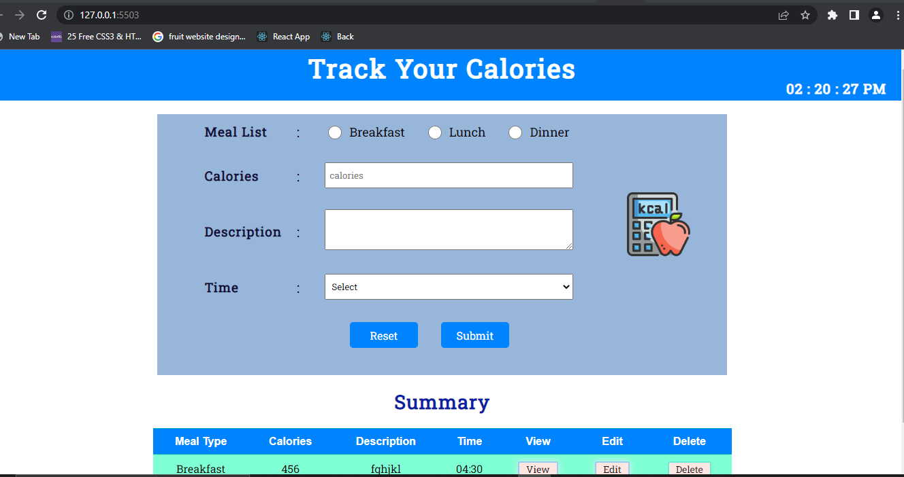
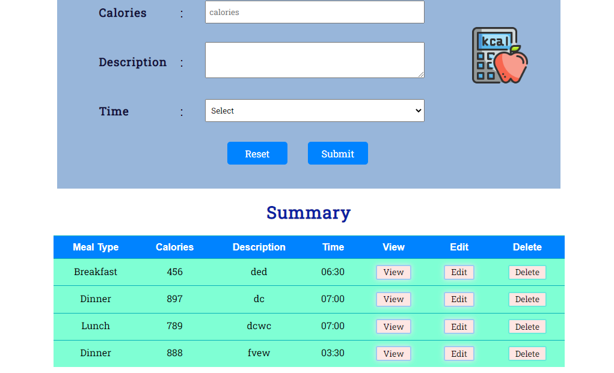
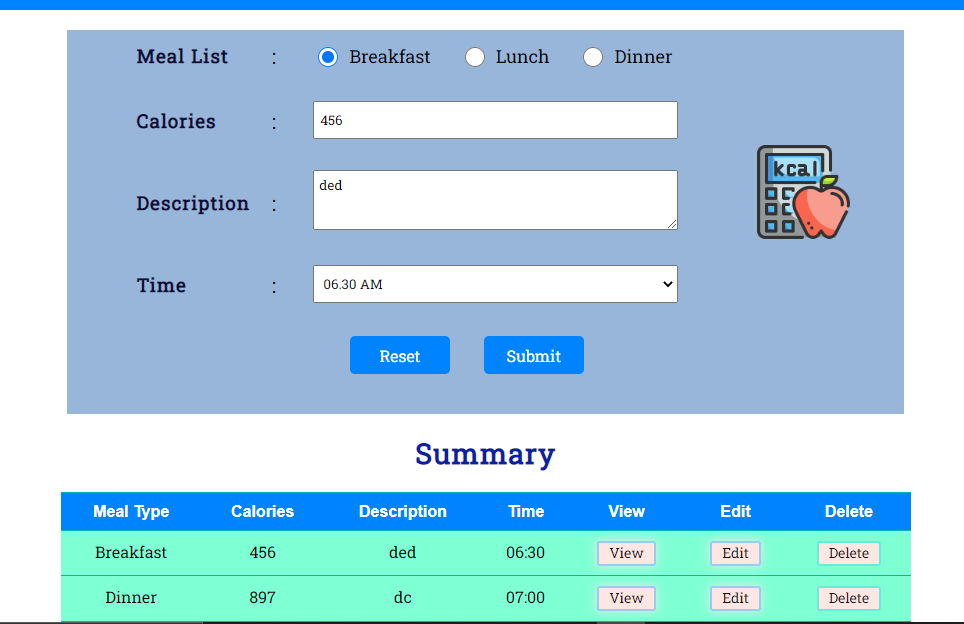
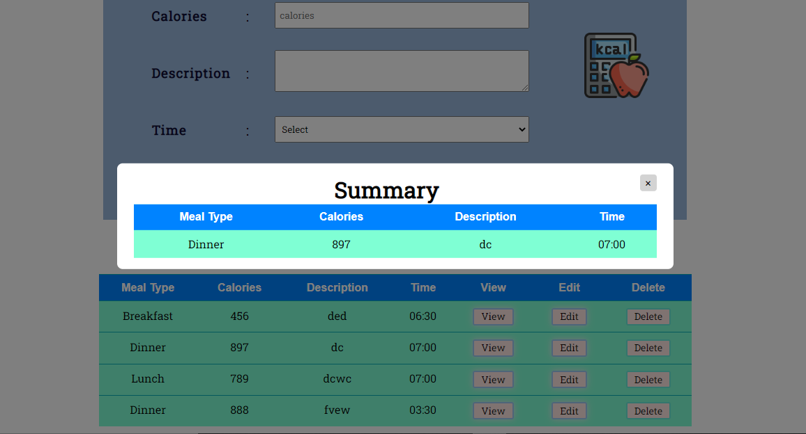
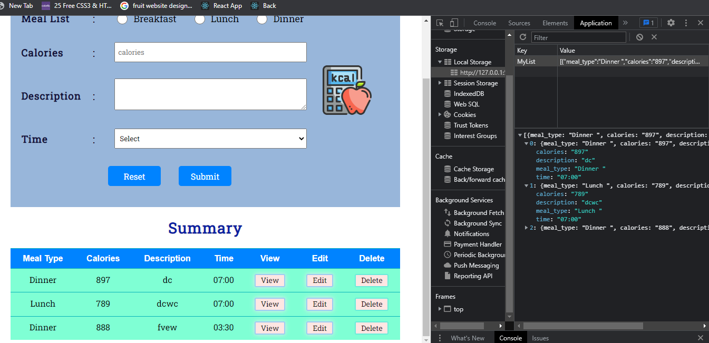
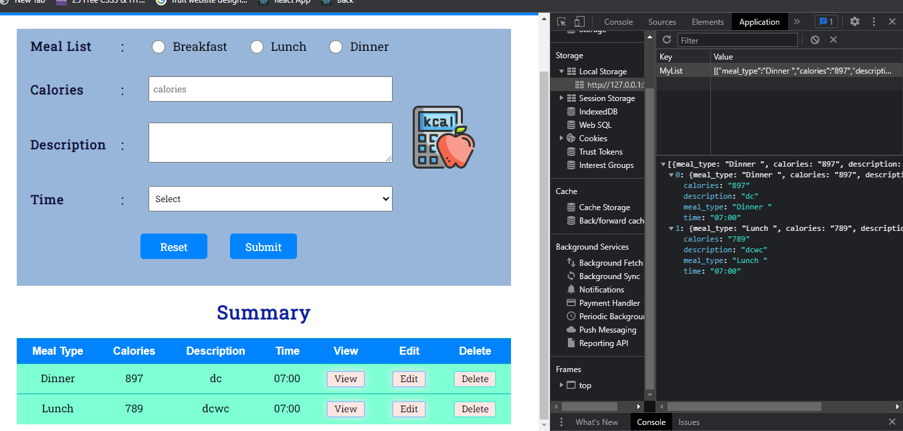

# Calories Tracker project

## Poject Desrciption:

Calories Tracker is a web Application  made of using pure Javascript's with HTML & CSS.This application basically track the calories of a person based on meal intake by him. It have a two sections, upper section contains a form having proper validation so that user can input its meal details including(MealType, Calories & Time). And below section contains a table that describes the summary nd contains information about what user inputs. Table also contains three buttons(edit, view , delete).Edit button is used to when user want to edit some data. on click on view button a model box popus that contain information of same row. and a delete button to delete particular entry.In this project Local Storage is used to store user input data in from of objects and also fetching data saved on locasl storage.

## Technology Used:

- JavaScript :- JavaScript is the Programming Language for the Web. JavaScript can update and change both HTML and CSS. JavaScript can calculate, manipulate and validate data.
- HTML: Hyper Text Markup Language is the standard markup language for creating Web pages, describes the structure of a Web page it consists of a series of elements that tell browser how to display the content.
- CSS: CSS is the language we use to style an HTML document & describes how HTML elements should be displayed.
- JSON: JavaScript Object Notation is a lightweight data-interchange format used to send data between computers.And it is language independent.

## What I've Learnt :
- HTML how to write Html, learn different tags & syntax to  make forms, Table, navbar, modelBox etc.
- How to apply CSS with class and Id. and their syntax.
- how to link CSS and script file.
- Basic knowledge of everything that belongs to css, html, js.
- writing clean and structure code.
- How to use props.
- how to save data on local storage and get data back fron local storage.
- use of JSON.
- how to open and close model box.
- how to set Timmer.
- how to apply validation on from.
- button onClick events, DOM events, etc.
- how to debug and identifying error and also resolve it.

## Getting Started with Project

### `To start`

One Can use Live server. to run this project.
Live Server: It enables us to right-click an HTML document, and it runs a server for us and opens a browser window with the file in it. Any changes we make to the file causes the browser to reload and we can immediately see them. 

### Home - Page

Home Screen
.

- user can enter data in form and submit form. validation for calories are breakfast can take calories of range between 300- 700 .
- And Lunch & Dinner can take calories range between 700-900.

### Summary Table

-From Here user can track their calories data.
- each row in table contains buttons for editing, view , delete data permanently.

### Clicking on edit button

- when click on edit button data of that row will render in form here user can make changes and saved back.

### Clicking on view Button

- when click on view button  model box displayed which contains data of that perticular row. 

### Local Storage

- Form data will save in local Storage like this...

### Clicking on Delete Button

- By clicking on delete button data will be permanently delete fron local storage.